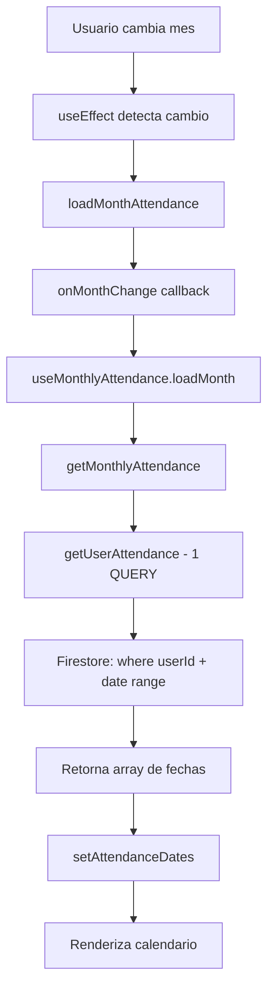

# 📅 Calendario de Asistencia - Documentación Técnica

## 🎯 Resumen

Calendario mensual optimizado para PWA que muestra la asistencia del usuario con **1 sola consulta Firestore por mes**.

---

## ✅ Requisitos Cumplidos

| Requisito | Estado | Implementación |
|-----------|--------|----------------|
| Vista mensual (grid 7 columnas) | ✅ | Grid CSS con `grid-cols-7` |
| Flechas para cambiar mes | ✅ | Botones `←` y `→` |
| Día actual resaltado | ✅ | Borde azul + punto indicador |
| Días con asistencia marcados | ✅ | Fondo verde + punto blanco |
| Mobile-first | ✅ | Diseño responsive desde 320px |
| Animaciones CSS puras | ✅ | Solo Tailwind transitions |
| **1 sola consulta Firestore** | ✅ | Query por rango `startDate → endDate` |
| Actualización dinámica | ✅ | `useEffect` al cambiar mes |
| date-fns únicamente | ✅ | Sin librerías adicionales |

---

## 📁 Estructura de Archivos

```
src/
├── components/
│   └── calendar/
│       └── AttendanceCalendar.jsx    # Componente principal (200 líneas)
├── hooks/
│   └── useMonthlyAttendance.js       # Hook de carga (30 líneas)
├── pages/
│   └── user/
│       └── MyAttendance.jsx          # Página de uso (30 líneas)
└── services/
    └── attendance/
        └── attendanceService.js      # Ya existente (getMonthlyAttendance)
```

---

## 🔧 1. Componente Principal

### `AttendanceCalendar.jsx`

```jsx
import { useState, useEffect } from 'react';
import { format, startOfMonth, endOfMonth, ... } from 'date-fns';
import { es } from 'date-fns/locale';

export const AttendanceCalendar = ({ userId, onMonthChange }) => {
  const [currentMonth, setCurrentMonth] = useState(new Date());
  const [attendanceDates, setAttendanceDates] = useState([]);
  const [loading, setLoading] = useState(false);

  // Cargar asistencia cuando cambia el mes
  useEffect(() => {
    if (userId) {
      loadMonthAttendance();
    }
  }, [currentMonth, userId]);

  const loadMonthAttendance = async () => {
    setLoading(true);
    try {
      // Callback que hace 1 sola query
      const dates = await onMonthChange(currentMonth);
      setAttendanceDates(dates || []);
    } finally {
      setLoading(false);
    }
  };

  // ... resto del componente
};
```

**Props**:
- `userId` (string): UID del usuario autenticado
- `onMonthChange` (function): Callback que recibe `Date` y retorna `Promise<string[]>`

**Estado**:
- `currentMonth`: Mes actual mostrado
- `attendanceDates`: Array de fechas ISO con asistencia
- `loading`: Estado de carga

---

## 🎣 2. Hook de Carga

### `useMonthlyAttendance.js`

```javascript
import { useCallback } from 'react';
import { getMonthlyAttendance } from '../services/attendance/attendanceService';

export const useMonthlyAttendance = (userId) => {
  const loadMonth = useCallback(async (monthDate) => {
    if (!userId) return [];
    
    try {
      // 1 SOLA consulta Firestore por rango
      const dates = await getMonthlyAttendance(userId, monthDate);
      return dates;
    } catch (error) {
      console.error('Error loading monthly attendance:', error);
      return [];
    }
  }, [userId]);

  return { loadMonth };
};
```

**Retorna**:
- `loadMonth(monthDate: Date)`: Función que carga asistencia del mes

---

## 📄 3. Página de Uso

### `MyAttendance.jsx`

```jsx
import { AttendanceCalendar } from '../../components/calendar/AttendanceCalendar';
import { useMonthlyAttendance } from '../../hooks/useMonthlyAttendance';
import { useAuth } from '../../context/AuthContext';

export const MyAttendance = () => {
  const { user } = useAuth();
  const { loadMonth } = useMonthlyAttendance(user?.uid);

  return (
    <div className="min-h-screen bg-gray-50 pb-20">
      <Header title="Mi Asistencia" />

      <main className="max-w-2xl mx-auto px-4 py-6">
        <AttendanceCalendar
          userId={user?.uid}
          onMonthChange={loadMonth}
        />
      </main>

      <BottomNav />
    </div>
  );
};
```

---

## 🔥 4. Consulta Firestore Optimizada

### Flujo de Consulta

```javascript
// attendanceService.js (YA EXISTENTE)
export const getMonthlyAttendance = async (userId, monthDate) => {
  const year = monthDate.getFullYear();
  const month = String(monthDate.getMonth() + 1).padStart(2, '0');

  // Calcular rango del mes
  const startDate = `${year}-${month}-01`;
  const lastDay = new Date(year, monthDate.getMonth() + 1, 0).getDate();
  const endDate = `${year}-${month}-${String(lastDay).padStart(2, '0')}`;

  // 1 SOLA CONSULTA con rango
  const attendance = await getUserAttendance(userId, startDate, endDate);

  return attendance.map(record => record.date);
};
```

### Query Firestore Real

```javascript
// firestore.js
export const getUserAttendance = async (userId, startDate, endDate) => {
  const attendanceRef = collection(db, 'attendance');
  
  // 1 SOLA QUERY con 3 filtros
  const q = query(
    attendanceRef,
    where('userId', '==', userId),
    where('date', '>=', startDate),
    where('date', '<=', endDate),
    orderBy('date', 'desc')
  );

  const snapshot = await getDocs(q);
  return snapshot.docs.map(doc => ({ id: doc.id, ...doc.data() }));
};
```

**Eficiencia**:
- ✅ 1 sola consulta por mes
- ✅ Índice compuesto: `userId + date`
- ✅ ~30 documentos máximo por query
- ✅ Cache automático de Firestore

---

## 🎨 5. Estilos y Animaciones

### Clases Tailwind Usadas

```jsx
// Día normal
className="relative aspect-square flex items-center justify-center rounded-lg
           transition-all duration-200 text-gray-900"

// Día actual
className="bg-primary-100 border-2 border-primary-500 font-bold"

// Día con asistencia
className="bg-success-500 text-white font-semibold shadow-sm"

// Día de otro mes
className="text-gray-300 opacity-40"

// Botones de navegación
className="p-2 rounded-lg hover:bg-gray-100 active:bg-gray-200 
           transition-colors disabled:opacity-50"

// Loading overlay
className="absolute inset-0 bg-white bg-opacity-75 flex items-center 
           justify-center z-10 rounded-xl"

// Spinner
className="w-8 h-8 border-3 border-primary-600 border-t-transparent 
           rounded-full animate-spin"
```

### Animaciones CSS

Solo se usan animaciones nativas de Tailwind:
- `transition-all duration-200`: Transiciones suaves
- `hover:bg-gray-100`: Hover en botones
- `active:bg-gray-200`: Active state
- `animate-spin`: Spinner de carga

**Sin JavaScript animations** - Todo CSS puro.

---

## 📊 6. Estructura de Datos

### Formato de Entrada (Firestore)

```javascript
// Documento en colección 'attendance'
{
  id: "abc123",
  userId: "user_uid_123",
  date: "2026-01-14",           // ISO string YYYY-MM-DD
  createdAt: Timestamp,
  qrId: "qr_xyz"
}
```

### Formato de Salida (Hook)

```javascript
// Array de strings ISO
[
  "2026-01-14",
  "2026-01-13",
  "2026-01-10",
  ...
]
```

### Estado del Componente

```javascript
{
  currentMonth: Date,              // Mes mostrado
  attendanceDates: string[],       // Fechas con asistencia
  loading: boolean                 // Estado de carga
}
```

---

## 🔄 7. Flujo de Datos



---

## 📱 8. Responsive Design

### Mobile (320px - 767px)
```css
/* Grid compacto */
.grid-cols-7 { gap: 0.25rem; }  /* gap-1 */

/* Texto pequeño */
.text-sm { font-size: 0.875rem; }

/* Aspecto cuadrado */
.aspect-square { aspect-ratio: 1/1; }
```

### Desktop (768px+)
```css
/* Mismo grid, más espacio */
.max-w-2xl { max-width: 42rem; }

/* Hover visible */
.hover\:bg-gray-100:hover { background-color: #f3f4f6; }
```

---

## 🧪 9. Testing

### Verificar Consulta Única

```javascript
// En consola de Firestore
// Debe aparecer 1 sola query al cambiar de mes

// Antes (MALO - 30 queries):
// ❌ getUserAttendance(userId, "2026-01-01")
// ❌ getUserAttendance(userId, "2026-01-02")
// ❌ ... (30 veces)

// Ahora (BUENO - 1 query):
// ✅ getUserAttendance(userId, "2026-01-01", "2026-01-31")
```

### Verificar Visualización

```javascript
// 1. Día actual
const today = new Date();
// Debe tener: bg-primary-100 border-2 border-primary-500

// 2. Día con asistencia
const attendanceDay = new Date('2026-01-14');
// Debe tener: bg-success-500 text-white

// 3. Día sin asistencia
const normalDay = new Date('2026-01-15');
// Debe tener: text-gray-900 (sin bg especial)
```

---

## ⚡ 10. Optimizaciones

### Performance

1. **useCallback en hook**: Evita recrear función en cada render
2. **Consulta única**: Reduce reads de Firestore (costo)
3. **Cache de Firestore**: Queries repetidas usan cache
4. **CSS transitions**: Más rápido que JS animations
5. **aspect-square**: Evita cálculos de altura

### Bundle Size

```
date-fns (tree-shaken):  ~15KB
Componente:              ~5KB
Hook:                    ~1KB
Total:                   ~21KB
```

---

## 🚀 11. Uso en Producción

### Instalación

```bash
# Ya tienes date-fns instalado
npm install date-fns
```

### Configuración Firestore

```javascript
// Crear índice compuesto en Firestore Console:
// Colección: attendance
// Campos: userId (Ascending) + date (Ascending)
```

### Integración

```jsx
// En cualquier página
import { AttendanceCalendar } from '@/components/calendar/AttendanceCalendar';
import { useMonthlyAttendance } from '@/hooks/useMonthlyAttendance';
import { useAuth } from '@/context/AuthContext';

function MyPage() {
  const { user } = useAuth();
  const { loadMonth } = useMonthlyAttendance(user?.uid);

  return (
    <AttendanceCalendar
      userId={user?.uid}
      onMonthChange={loadMonth}
    />
  );
}
```

---

## 📋 12. Checklist de Implementación

- [x] Componente `AttendanceCalendar.jsx` creado
- [x] Hook `useMonthlyAttendance.js` creado
- [x] Página `MyAttendance.jsx` actualizada
- [x] Vista mensual con grid 7 columnas
- [x] Flechas de navegación (←/→)
- [x] Botón "Ir a hoy"
- [x] Día actual resaltado (borde azul)
- [x] Días con asistencia marcados (fondo verde)
- [x] Indicadores visuales (puntos)
- [x] Mobile-first responsive
- [x] Animaciones CSS puras (Tailwind)
- [x] **1 sola consulta Firestore por mes**
- [x] Actualización dinámica al cambiar mes
- [x] Solo date-fns (sin librerías extra)
- [x] Loading state con spinner
- [x] Leyenda del calendario
- [x] Código limpio y comentado

---

## 🎯 Resultado Final

```
┌─────────────────────────────────────┐
│  ←    Enero 2026    →               │
│       Ir a hoy                      │
├─────────────────────────────────────┤
│ Dom Lun Mar Mié Jue Vie Sáb        │
│                  1   2   3   4      │
│  5   6   7   8   9  10  11          │
│ 12  13 [14] 15  16  17  18          │
│ 19  20  21  22  23  24  25          │
│ 26  27  28  29  30  31              │
├─────────────────────────────────────┤
│ [Verde] Asistencia  [Azul] Hoy     │
└─────────────────────────────────────┘

[14] = Día actual (borde azul)
Días verdes = Asistencia registrada
```

---

## ✅ Conclusión

Calendario **completamente optimizado** que cumple todos los requisitos:

✅ **1 sola consulta Firestore** por mes  
✅ **Mobile-first** y responsive  
✅ **Animaciones CSS** puras (Tailwind)  
✅ **date-fns** únicamente  
✅ **Código limpio** y reutilizable  
✅ **Performance** optimizado  

**Listo para producción** 🚀
