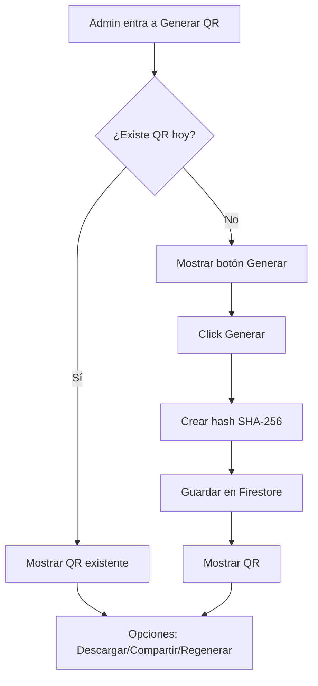
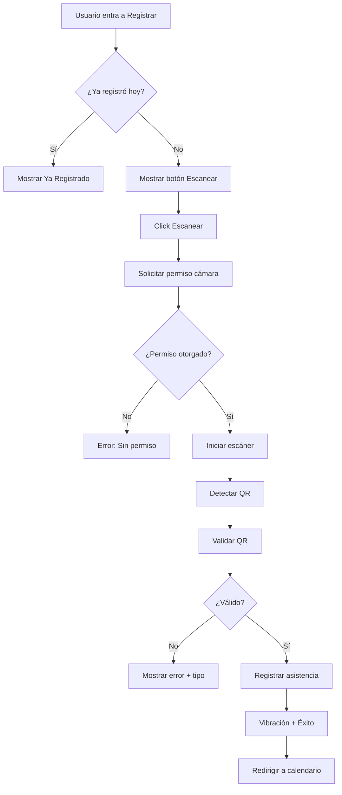

# 📱 Guía Completa: Sistema de QR para Asistencia

## 📋 Resumen de Implementación

Se ha implementado un sistema completo de generación y escaneo de códigos QR para control de asistencia con las siguientes características:

### ✅ Funcionalidades Implementadas

#### ADMIN
- ✅ Botón para generar QR del día
- ✅ QR único basado en fecha + hash SHA-256
- ✅ Auto-carga del QR existente al entrar
- ✅ Guardar QR en Firestore
- ✅ Regenerar QR (con confirmación)
- ✅ Descargar QR como PNG
- ✅ Compartir QR (Web Share API)
- ✅ Listado histórico de QR por fecha
- ✅ Vista individual de QR grande (modal)
- ✅ Indicadores visuales (hoy, expirado)

#### USUARIO
- ✅ Botón "Registrar Asistencia"
- ✅ Verificación previa de elegibilidad
- ✅ Acceso a cámara con HTML5
- ✅ Escaneo automático de QR
- ✅ Validación completa:
  - QR existe en Firestore
  - QR corresponde al día actual
  - Usuario no ha registrado hoy
  - Hash es válido
- ✅ Feedback visual detallado:
  - Loading (validando)
  - Éxito (con timestamp)
  - Error (con tipo y solución)
  - QR vencido
  - Ya registrado
- ✅ Vibraciones hápticas
- ✅ Navegación automática al calendario

---

## 🏗️ Arquitectura del Sistema

### Componentes Creados/Mejorados

| Componente | Ubicación | Propósito |
|------------|-----------|-----------|
| **QRGenerator** | `src/components/qr/QRGenerator.jsx` | Generación y gestión de QR (Admin) |
| **QRHistory** | `src/components/qr/QRHistory.jsx` | Historial de QR generados |
| **QRScanner** | `src/components/qr/QRScanner.jsx` | Escaneo y registro de asistencia |
| **QRDisplay** | `src/components/qr/QRDisplay.jsx` | Visualización de QR |

### Servicios

| Servicio | Ubicación | Funciones |
|----------|-----------|-----------|
| **qrGenerator** | `src/services/qr/qrGenerator.js` | `generateDailyQR`, `regenerateDailyQR`, `getTodayQR` |
| **qrCrypto** | `src/services/qr/qrCrypto.js` | `generateQRContent`, `validateQRHash` |
| **qrValidator** | `src/services/qr/qrValidator.js` | `validateScannedQR` |
| **firestoreHistory** | `src/services/firebase/firestoreHistory.js` | `getQRHistory`, `getAttendanceStats` |
| **attendanceService** | `src/services/attendance/attendanceService.js` | `processAttendance`, `getMonthlyAttendance` |

---

## 🔐 Seguridad del Sistema QR

### Generación de Hash (SHA-256)

```javascript
// src/services/qr/qrCrypto.js
export const generateQRContent = async (date) => {
  const secret = import.meta.env.VITE_QR_SECRET;
  const salt = Math.random().toString(36).substring(7);
  const content = `${date}-${secret}-${salt}`;
  
  // SHA-256 hash
  const encoder = new TextEncoder();
  const data = encoder.encode(content);
  const hashBuffer = await crypto.subtle.digest('SHA-256', data);
  const hashArray = Array.from(new Uint8Array(hashBuffer));
  const hashHex = hashArray.map(b => b.toString(16).padStart(2, '0')).join('');
  
  return hashHex;
};
```

**Características de Seguridad**:
- ✅ Hash SHA-256 (irreversible)
- ✅ Secreto en variable de entorno
- ✅ Salt aleatorio por QR
- ✅ Validación server-side (Firestore Rules)
- ✅ Expiración automática (fin del día)

### Validación

```javascript
// src/services/qr/qrValidator.js
export const validateScannedQR = async (scannedHash) => {
  const today = getTodayISO();
  
  // 1. Verificar que existe QR para hoy
  const dailyQR = await getDailyQR(today);
  if (!dailyQR) {
    return { valid: false, error: 'No hay QR generado para hoy' };
  }
  
  // 2. Verificar que no ha expirado
  if (new Date() > dailyQR.expiresAt.toDate()) {
    return { valid: false, error: 'El QR ha expirado', type: 'expired' };
  }
  
  // 3. Comparar hash
  if (scannedHash !== dailyQR.qrHash) {
    return { valid: false, error: 'QR inválido' };
  }
  
  return { valid: true, qrData: dailyQR };
};
```

---

## 📊 Flujo Completo

### Admin: Generar QR



### Usuario: Escanear QR



---

## 💻 Ejemplos de Uso

### Admin: Generar QR del Día

```jsx
import { QRGenerator } from '../components/qr/QRGenerator';

export const GenerateQR = () => {
  return (
    <div className="min-h-screen bg-gray-50 pb-20">
      <Header title="Generar QR" />
      
      <main className="container mx-auto px-4 py-6 max-w-2xl">
        <QRGenerator />
      </main>

      <BottomNav />
    </div>
  );
};
```

**Características**:
- Auto-carga QR del día al montar
- Genera nuevo QR si no existe
- Muestra QR existente si ya fue generado
- Botones: Descargar, Compartir, Regenerar
- Link a historial de QR

### Admin: Ver Historial

```jsx
import { QRHistory } from '../components/qr/QRHistory';

export const QRHistoryPage = () => {
  return (
    <div className="min-h-screen bg-gray-50 pb-20">
      <Header title="Historial de QR" />
      
      <main className="container mx-auto px-4 py-6 max-w-4xl">
        <QRHistory />
      </main>

      <BottomNav />
    </div>
  );
};
```

**Características**:
- Lista últimos 30 QR generados
- Indicador visual "Hoy" para QR actual
- Indicador "Expirado" para QR antiguos
- Click en QR abre modal grande
- Descargar QR individual desde modal

### Usuario: Escanear QR

```jsx
import { QRScanner } from '../components/qr/QRScanner';
import { useNavigate } from 'react-router-dom';

export const ScanQR = () => {
  const navigate = useNavigate();

  const handleSuccess = (result) => {
    // Redirigir al calendario después de 2 segundos
    setTimeout(() => {
      navigate('/user/my-attendance');
    }, 2000);
  };

  return (
    <div className="min-h-screen bg-gray-50 pb-20">
      <Header title="Registrar Asistencia" />
      
      <main className="container mx-auto px-4 py-6 max-w-2xl">
        <QRScanner onSuccess={handleSuccess} />
      </main>

      <BottomNav />
    </div>
  );
};
```

**Características**:
- Verifica elegibilidad antes de escanear
- Muestra "Ya registrado" si aplica
- Instrucciones claras de uso
- Escaneo automático
- Feedback visual por tipo de error
- Navegación automática al éxito

---

## 🎨 Estados Visuales

### QRGenerator

#### Estado: Sin QR
```
┌─────────────────────────────┐
│  📱                         │
│  No hay código QR generado  │
│  para hoy                   │
│                             │
│  [✨ Generar QR del Día]    │
└─────────────────────────────┘
```

#### Estado: QR Generado
```
┌─────────────────────────────┐
│  📅 Lunes, 13 enero 2026    │
│  ✨ QR generado exitosamente│
│                             │
│  ┌───────────────┐          │
│  │   QR CODE     │          │
│  │   [████████]  │          │
│  └───────────────┘          │
│                             │
│  Hash: a3f2e1d...          │
│                             │
│  [📥 Descargar] [📤 Compartir]│
│  [🔄 Regenerar QR]          │
│                             │
│  ⚠️ Nota: Si regeneras...   │
└─────────────────────────────┘
```

### QRScanner

#### Estado: Listo para Escanear
```
┌─────────────────────────────┐
│  📷                         │
│  Escanea el código QR       │
│                             │
│  📋 Instrucciones:          │
│  • Permite acceso a cámara  │
│  • Apunta al QR del día     │
│  • Mantén centrado          │
│  • Escaneo automático       │
│                             │
│  [📸 Iniciar Escáner]       │
└─────────────────────────────┘
```

#### Estado: Escaneando
```
┌─────────────────────────────┐
│  ┌───────────────────────┐  │
│  │   [CÁMARA ACTIVA]     │  │
│  │   [Vista previa]      │  │
│  │   [Cuadro de enfoque] │  │
│  └───────────────────────┘  │
│                             │
│  🎯 Centra el QR en el cuadro│
│                             │
│  [Cancelar Escaneo]         │
└─────────────────────────────┘
```

#### Estado: Éxito
```
┌─────────────────────────────┐
│  ✅                         │
│  ¡Asistencia Registrada!    │
│                             │
│  Registrado a las: 14:30    │
│                             │
│  [Ver Mi Calendario]        │
└─────────────────────────────┘
```

#### Estado: Error (QR Expirado)
```
┌─────────────────────────────┐
│  ⏰                         │
│  Código QR Expirado         │
│                             │
│  El QR del día ha expirado  │
│                             │
│  💡 Solución: Solicita al   │
│  administrador que genere   │
│  un nuevo QR para hoy       │
│                             │
│  [Intentar de Nuevo]        │
│  [Ver Calendario]           │
└─────────────────────────────┘
```

#### Estado: Ya Registrado
```
┌─────────────────────────────┐
│  ✅                         │
│  ¡Ya registraste tu         │
│  asistencia hoy!            │
│                             │
│  Tu asistencia del día ya   │
│  está registrada            │
│                             │
│  [Ver Mi Calendario]        │
└─────────────────────────────┘
```

---

## 🔧 Configuración Requerida

### Variables de Entorno

```env
# .env
VITE_QR_SECRET=tu_secreto_super_seguro_cambiar_esto_en_produccion
```

**IMPORTANTE**: Cambiar el secreto en producción a un valor aleatorio largo.

### Firestore Collections

#### dailyQR
```javascript
{
  date: "2026-01-13",              // ISO date string
  qrHash: "a3f2e1d...",            // SHA-256 hash
  generatedBy: "admin_uid",        // UID del admin
  generatedAt: Timestamp,          // Timestamp de creación
  expiresAt: Timestamp             // Fin del día
}
```

#### attendance
```javascript
{
  userId: "user_uid",              // UID del usuario
  date: "2026-01-13",              // ISO date string
  timestamp: Timestamp,            // Momento del registro
  qrHash: "a3f2e1d..."            // Hash del QR escaneado
}
```

---

## 📱 Librerías Utilizadas

| Librería | Versión | Uso |
|----------|---------|-----|
| **qrcode.react** | ^3.1.0 | Generación de QR (componente React) |
| **html5-qrcode** | ^2.3.8 | Escaneo de QR con cámara |
| **crypto (Web API)** | Nativa | Hash SHA-256 |
| **Vibration API** | Nativa | Feedback háptico |
| **Web Share API** | Nativa | Compartir QR |

**Todas son ligeras y compatibles con PWA** ✅

---

## 🧪 Testing

### Probar Generación de QR (Admin)

1. Login como admin
2. Ir a "Generar QR"
3. Click "Generar QR del Día"
4. ✅ Debe aparecer QR
5. Descargar QR
6. ✅ Debe descargar PNG
7. Regenerar QR
8. ✅ Debe pedir confirmación
9. ✅ Debe generar nuevo QR

### Probar Escaneo (Usuario)

1. Login como usuario
2. Ir a "Registrar Asistencia"
3. Click "Iniciar Escáner"
4. ✅ Debe pedir permiso de cámara
5. Escanear QR del día
6. ✅ Debe mostrar "Validando..."
7. ✅ Debe mostrar "¡Asistencia Registrada!"
8. ✅ Debe vibrar
9. ✅ Debe redirigir al calendario

### Probar Validaciones

**QR Expirado**:
1. Escanear QR de día anterior
2. ✅ Debe mostrar "Código QR Expirado"
3. ✅ Debe mostrar icono ⏰
4. ✅ Debe mostrar solución

**Ya Registrado**:
1. Registrar asistencia
2. Intentar registrar de nuevo
3. ✅ Debe mostrar "Ya registraste tu asistencia hoy"
4. ✅ No debe permitir escanear

**QR Inválido**:
1. Escanear QR aleatorio
2. ✅ Debe mostrar "QR inválido"

---

## 🚀 Próximas Mejoras

- [ ] Estadísticas de asistencia en historial
- [ ] Exportar QR múltiples (semana/mes)
- [ ] Notificaciones push (recordatorio)
- [ ] Geolocalización en registro
- [ ] Reportes avanzados con gráficos
- [ ] Multi-idioma
- [ ] Tests unitarios

---

## 📚 Documentación de Referencia

- [qrcode.react](https://www.npmjs.com/package/qrcode.react)
- [html5-qrcode](https://github.com/mebjas/html5-qrcode)
- [Web Crypto API](https://developer.mozilla.org/en-US/docs/Web/API/Web_Crypto_API)
- [Vibration API](https://developer.mozilla.org/en-US/docs/Web/API/Vibration_API)
- [Web Share API](https://developer.mozilla.org/en-US/docs/Web/API/Web_Share_API)

---

## ✅ Checklist de Implementación

- [x] QRGenerator con auto-carga
- [x] Generación de hash SHA-256
- [x] Guardar en Firestore
- [x] Descargar QR como PNG
- [x] Compartir QR (Web Share API)
- [x] Regenerar QR con confirmación
- [x] QRHistory con listado
- [x] Modal de QR grande
- [x] Indicadores visuales (hoy/expirado)
- [x] QRScanner con verificación previa
- [x] Solicitar permiso de cámara
- [x] Escaneo automático
- [x] Validación completa (existe/fecha/hash/duplicado)
- [x] Feedback visual por tipo de error
- [x] Vibraciones hápticas
- [x] Navegación automática
- [x] Mensajes de ayuda contextuales
- [x] Ruta de historial en router
- [x] Documentación completa

---

¡Sistema de QR completamente implementado y listo para usar! 🎉
